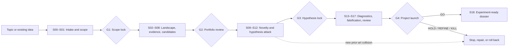

# Research Forge

[English](README.md) · [简体中文](README.zh-CN.md)

> **Do not ask whether a research idea sounds novel. Try to prove that it is not.**

<p align="center">
  
</p>

Research Forge is a stateful, adversarial research-direction Skill for AI and deep-learning method research. It turns a vague topic or a favored idea into an evidence-linked `GO`, `HOLD`, `REFINE`, `HOLD_RESOURCE`, or `KILL` decision—before expensive experiments begin.

**Status:** v1.2 protocol implementation. The repository contains deterministic contract checks, but it does not claim an empirical performance advantage over other Skills or guarantee research success.

## 中文简介

Research Forge 不是一个“批量生成创新点”的灵感工具，而是一套面向 AI 方法研究的对抗式科研决策协议。它会主动寻找最强先验工作、拆解被已有研究覆盖的创新主张、区分事实与推测、要求无方法依赖的机制假设，并优先设计成本最低但信息量最高的证伪测试。整个流程由 S00–S18 状态机、四个人工决策门、证据与威胁账本、回滚机制和审稿人攻击共同约束。最终的 `GO` 只表示“值得进入实验验证”，不代表方法一定有效，也不代表一定能够发表。

## Why Research Forge

Many research workflows are good at producing plausible directions. Plausibility is not the hard part.

A direction can still fail because:

- the supposed gap is already covered by strong prior art;
- the contribution disappears when broad claims are peeled away;
- the method has no mechanism-level hypothesis or discriminating prediction;
- an easier alternative explanation fits the same observations;
- the proposed experiment cannot falsify the core claim;
- gains depend on unmatched data, compute, tuning, or evaluation;
- the idea is scientifically interesting but currently infeasible;
- the project survives internal discussion but collapses under reviewer scrutiny.

Research Forge treats topic selection as a **research-risk reduction problem**. Its job is not to defend an idea. Its job is to determine what, if anything, survives serious attack.

## How Research Forge differs

This is a contract comparison, not an empirical benchmark. “Common workflow” below is a simplified archetype; it does not describe every research assistant or topic-selection Skill.

| Dimension | Common idea-generation or topic-selection workflow | Research Forge contract |
|---|---|---|
| Primary objective | Produce plausible, interesting directions | Reach an evidence-linked project decision |
| Default stance | Expand and improve an idea | Search to reject and expose failure conditions |
| Literature role | Summarize related work | Build a query graph, steelman prior art, and attack novelty |
| Literature provenance | A remembered title can drift into a claim | Awareness-only leads stay non-citable until resolved to source-backed records |
| Starting point | Start from a module, title, or target venue | Require a researchable question, an auditable problem signal, and a minimum discriminating path |
| Novelty | Treat an apparent gap as a candidate contribution | Peel overlapped claims and preserve a qualified residual boundary |
| Candidate revisions | Rewrite the idea until it sounds better | Version core commitments and invalidate stale downstream tests/reviews |
| Knowledge control | Blend sources and interpretation into prose | Separate evidence, claims, inferences, hypotheses, contradictions, and unknowns |
| Hypothesis | Often follows the proposed architecture | Must be method-free, mechanistic, predictive, and falsifiable |
| Experiments | Demonstrate gains after a method is selected | Start with the cheapest test that can kill or discriminate the hypothesis |
| Baselines | Compare reported scores | Match data, optimization, augmentation, evaluation, and tuning budgets |
| Process memory | Conversation or one-shot report | Versioned project state, stable IDs, snapshots, rollback, and decision logs |
| Human control | Agent may continue by default | Four explicit gates; silence never counts as approval |
| Final result | Ranked ideas or a research plan | `GO`, `HOLD`, `REFINE`, `HOLD_RESOURCE`, or `KILL`, plus an experiment dossier after explicit GO |

## What makes it different

### 1. Search is designed to reject

The [search protocol](protocols/search.md) builds query families around problems, mechanisms, claims, neighboring terminology, citations, and current work. Strong prior art is interpreted in its strongest reasonable form. Novelty-sensitive work requires a recorded cutoff date and a fresh search rather than an unsupported claim of being “latest.”

Threats progress through **T0–T5**, while sources are read at **R0–R4** depth. Formal T4/T5 threats require deep verification from appropriate primary sources; a search snippet is not enough.

### 2. Evidence and reasoning remain inspectable

Research Forge does not flatten everything into confident prose. The [evidence protocol](protocols/evidence.md) and schemas preserve stable, linked records for:

- evidence and provenance;
- claims and dependency edges;
- novelty threats and affected claims;
- hypotheses, alternatives, predictions, and falsifiers;
- contradictions and unresolved reasoning debt;
- candidate genealogy and decision history.

`FACT`, `INFERENCE`, `HYPOTHESIS`, and `UNKNOWN` are different epistemic states. Missing evidence means unresolved; it does not automatically mean false.

### 3. Novelty is what survives claim peeling

An overlap does not trigger rhetorical repositioning. The [novelty protocol](protocols/novelty.md) records which claim was killed, what killed it, what survives, and whether the survivor still has mechanistic depth, scientific generality, impact, and a meaningful optimization space. A newly verified collision can freeze the project even after a prior GO.

### 4. Signatures compare mechanisms; commitments preserve the audit trail

For every comparison-critical paper and every candidate, Research Forge records an [innovation signature](protocols/innovation-signature.md): bottleneck, operation, changed object, critical condition, and predicted contrast. This makes a reviewer-facing question concrete: does the closest work already subsume the same mechanism, even if it uses another title or implementation?

Unresolved historical hints are stored as `AWARENESS_ONLY` `AL-` leads. They can guide search, but they are never citations, evidence, novelty support, or BibTeX entries. A candidate also has a versioned `CM-` candidate commitment. If its mechanism, prediction, falsifier, or budget changes, the [commitment-integrity protocol](protocols/commitment-integrity.md) creates a superseding version and requires the affected novelty maps, tests, feasibility estimates, reviews, and gates to be revalidated.

This is deliberately not a success-pattern scorer: historical acceptance/citation outcomes and pattern frequency are not evidence or ranking priors.

### 5. Researchability comes before a portfolio

S00–S01 now create a [research-question canvas](protocols/researchability.md): the phenomenon, unit and condition, knowledge gap, mechanism question, observable outcome, minimum discriminating path, three nested scopes, and a stop-or-reframe condition. A `FIT-` card separates hard constraints, preferences, assumptions, capability gaps, and dependency owners.

Candidates are linked to [opportunity signals](protocols/opportunity-signals.md)—such as verified slice failures, replications, limitations, negative results, evaluation artifacts, or deployment constraints—not merely a fashionable module swap. A user report, GitHub issue, or mentor comment can start a lead, but it must be verified before becoming a scientific premise.

### 6. Hypothesis comes before architecture

The core hypothesis must describe a mechanism without depending on a favorite module name. It must predict observations that distinguish it from steelmanned alternatives. See the [hypothesis protocol](protocols/hypothesis.md).

This prevents familiar combinations—“backbone X plus loss Y for task Z”—from being mistaken for a scientific contribution merely because the components have not been combined under the same name.

### 7. Falsification comes before optimization

The [falsification protocol](protocols/falsification.md) asks for the cheapest high-information test capable of rejecting the mechanism, exposing a negligible ceiling, or favoring a simpler explanation. Decision thresholds and ambiguity branches are recorded before results are examined.

Negative evidence remains part of project memory. Sunk cost, implementation effort, and author preference do not weaken a valid killer.

### 8. The process has state, gates, and rollback

Research Forge runs an **S00–S18** state machine instead of a one-shot prompt. Four explicit human gates control scope, candidate selection, hypothesis lock, and project launch. Before deep reading, the [literature-triage protocol](protocols/literature-triage.md) prioritizes sources that can change a decision and makes full-text/access gaps visible. Invalidated evidence can trigger local repair, structural rollback, or state re-entry while preserving lineage. See [gates](runtime/gates.md) and [rollback](runtime/rollback.md).

### 9. Scientific value and execution readiness are separate

A promising direction is not scientifically false because compute, data, licensing, or implementation access is currently missing. Research Forge separates scientific, execution, and publication decisions; resource limitations can produce `HOLD_RESOURCE` rather than a fabricated scientific rejection.

### 10. GO produces a handoff contract, not a victory message

After explicit G4 approval, S18 assembles a 30-element experiment-ready dossier with claims, assumptions, controls, metrics, thresholds, failure branches, resource estimates, and exact next actions. The downstream experiment runner may execute the plan but may not silently rewrite its scientific contracts. See the [handoff protocol](runtime/handoff.md).

## Lifecycle



## When to use it

Use Research Forge when you have:

- a broad AI-method topic that needs a defensible candidate portfolio;
- an existing idea that needs an adversarial novelty and mechanism audit;
- uncertainty about whether an apparent literature gap is scientifically meaningful;
- a promising observation but no clean mechanism hypothesis;
- a project that should be triaged before costly training;
- a direction that needs pre-submission reviewer-style attack;
- an interrupted Research Forge project with valid saved state.

It is not the right tool when you only need a quick list of ideas, a general literature summary, a full manuscript, or autonomous long-running experiments.

## How to use

### Prerequisites

You need:

- an agent host that can load directory-based Skills;
- Python 3 to run the included deterministic checks;
- a writable location for a separate research-project workspace;
- current web, scholarly-search, or full-text tools when novelty depends on recent literature;
- a human who can make the four gate decisions.

Research Forge defines the protocol. It does not itself grant database access, retrieve paywalled papers, or run model training. Available evidence depends on the tools and permissions of the host environment.

### Install

For a personal Codex installation:

1. Download or clone this complete repository.
2. Place the directory at `~/.codex/skills/research-forge/`.
3. Confirm that `~/.codex/skills/research-forge/SKILL.md` exists directly inside it.
4. Reload the host so it discovers the Skill.

For another compatible agent host, place the repository in that host’s Skills directory. Keep the internal directory structure intact: `SKILL.md` routes execution, while `protocols/`, `states/`, `schemas/`, `templates/`, `runtime/`, and `domain/` hold separate contracts.

### Minimal install package

If you only want the executable Skill files, install the [`skill-only` branch](https://github.com/DexZane/Research-Forge/tree/skill-only). It excludes README files, examples, tests, design notes, and poster assets:

```bash
python3 ~/.codex/skills/.system/skill-installer/scripts/install-skill-from-github.py \
  --repo DexZane/Research-Forge --ref skill-only --path . --name research-forge
```

The corresponding raw URL is useful for inspecting the entry file:
[`SKILL.md`](https://raw.githubusercontent.com/DexZane/Research-Forge/skill-only/SKILL.md). A raw URL downloads one file; use the GitHub tree URL or the installer command for the complete Skill.

### Install through an Agent

If your coding agent has network and filesystem access, paste the following request into it:

```text
Install and verify Research Forge by following this guide exactly:
https://raw.githubusercontent.com/DexZane/Research-Forge/main/docs/guide/installation.md

Install the complete skill-only package, not only SKILL.md. Do not overwrite an existing installation. Report the target path, checked-out commit, and verification result.
```

You can also read the [installation guide](docs/guide/installation.md) yourself. An Agent can fetch the same guide with:

```bash
curl -fsSL https://raw.githubusercontent.com/DexZane/Research-Forge/main/docs/guide/installation.md
```

### Agent compatibility and install locations

Research Forge uses the directory-based Agent Skills layout: keep `SKILL.md` at the root of a `research-forge/` directory, with `protocols/`, `states/`, `domain/`, `templates/`, `schemas/`, and `runtime/` beside it. The research protocol is portable; automatic discovery and invocation are runtime-specific.

| Agent runtime | User-level location | Project-level location | Support |
|---|---|---|---|
| [Codex](https://github.com/openai/skills) | `~/.codex/skills/research-forge/` | Host-specific | Native directory Skill; use the installer above |
| [Claude Code](https://code.claude.com/docs/en/skills) | `~/.claude/skills/research-forge/` | `.claude/skills/research-forge/` | Native `SKILL.md` support |
| [Gemini CLI](https://geminicli.com/docs/cli/skills/) | `~/.gemini/skills/research-forge/` or `~/.agents/skills/research-forge/` | `.gemini/skills/research-forge/` or `.agents/skills/research-forge/` | Native Agent Skills support |
| [GitHub Copilot CLI](https://docs.github.com/en/copilot/reference/copilot-cli-reference/cli-command-reference) | `~/.copilot/skills/research-forge/` or `~/.agents/skills/research-forge/` | `.github/skills/research-forge/`, `.agents/skills/research-forge/`, or `.claude/skills/research-forge/` | Native `SKILL.md` support |
| [OpenCode](https://opencode.ai/docs/skills) | `~/.config/opencode/skills/research-forge/` or `~/.agents/skills/research-forge/` | `.opencode/skills/research-forge/`, `.agents/skills/research-forge/`, or `.claude/skills/research-forge/` | Native Agent Skills support |
| [Cursor](https://docs.cursor.com/context/rules-for-ai) | No native `SKILL.md` location | `.cursor/rules/research-forge.mdc` or `.cursor/commands/research-forge.md` | Adapter required; preserve or manually attach the referenced folders |
| Other or API-only agents | No universal location | Runtime-specific | Manually inject `SKILL.md` and give the agent access to its referenced folders and tools |

For runtimes that support the interoperable `.agents/skills/` alias, copy the complete Skill directory there. `agents/openai.yaml` is Codex UI metadata; other runtimes may ignore it. Do not copy only the raw `SKILL.md`, because the state, protocol, schema, template, and runtime references are part of the executable Skill contract. Locations and CLI flags can change, so check the linked vendor documentation for the installed version.

Installing the Skill and creating a research project are different operations. Do not store live research records inside the installed Skill directory.

### Invoke

When the host exposes installed Skills by name, invoke:

```text
/research-forge
```

If the host uses a menu or another invocation convention, select `research-forge` by name. Provide either a broad research direction, an existing idea, or the absolute path of a project to resume.

Research Forge creates or resumes a separate **research-project workspace**. The Skill repository is the protocol; the project workspace is the evolving research memory.

#### 1. Explore a broad direction

Use `EXPLORATION` when you want to map a topic before committing to an idea.

```text
/research-forge

Use EXPLORATION mode.
Topic: robust tiny-object detection for edge deployment.
Starting observation: small instances fail disproportionately under aggressive downsampling.
Constraints: public datasets, two consumer GPUs, six-week validation window.
Publication horizon: current major computer-vision venues.
Project workspace: /absolute/path/to/tiny-object-research

Build diverse mechanism candidates, search to reject them, and stop at every
human gate. Do not treat the starting observation as a verified cause.
```

Expected early behavior: S00 records the observation as unverified, G1 locks the research boundary, and S02–S08 build and attack a diverse candidate portfolio before G2 selects finalists.

#### 2. Validate an existing idea

Use `IDEA_VALIDATION` when you already have a candidate method or novelty claim.

```text
/research-forge

Use IDEA_VALIDATION mode.
Candidate idea: replace the YOLO feature-fusion block with a state-space module
to improve tiny-object context modeling.
Claimed mechanism: longer-range spatial interactions recover context lost by
local fusion.
Constraints: preserve real-time inference and use the same training data.
Project workspace: /absolute/path/to/ssm-yolo-audit

Preserve the original idea, generate alternative mechanisms, attack the claim
with the strongest prior art, and identify the residual contribution after
innovation peeling. Stop at every human gate.
```

The mode does not assume the idea is novel. It preserves the original candidate so that later refinements, killed claims, and alternative-mechanism candidates remain traceable.

#### 3. Resume a project

Resume from the project root rather than restating the research history from memory.

```text
/research-forge

Resume the Research Forge project at:
/absolute/path/to/tiny-object-research

Validate saved state and the latest immutable snapshot, load blocking threats,
contradictions, reasoning debt, search freshness, and the pending gate, then
continue from the current valid state. Do not silently reconstruct uncertain data.
```

The runtime loads `state/research_state.yaml`, snapshots, active candidates and hypotheses, T4/T5 threats, open contradictions, blocking debt, search status, and recent decisions in a fixed recovery order.

### Work through the human gates

Research Forge must stop and ask for an explicit decision at each gate:

| Gate | Human decision |
|---|---|
| `G1_SCOPE_LOCK` | Approve or revise the RQ canvas, minimum/core/extension scope, fit constraints, and research boundaries |
| `G2_PORTFOLIO_REVIEW` | Review survivors, their problem signals/minimum paths, kills, threats, cost, and uncertainty; select at most 1–3 finalists |
| `G3_HYPOTHESIS_LOCK` | Lock a surviving method-free hypothesis, alternatives, predictions, and falsifiers |
| `G4_PROJECT_LAUNCH` | Choose GO, HOLD, KILL, or REVISE from the project-decision packet |

Silence is not approval. You can approve, request revisions, hold the project, or reject the proposed transition. S18 is unavailable until `G4_PROJECT_LAUNCH` receives an explicit GO.

## Decisions and outputs

| Decision | Meaning |
|---|---|
| `GO` | Scientific case survives current gates and is worth testing under the recorded conditions |
| `HOLD` | Evidence, measurement validity, power, or a dependency is insufficient for a decision |
| `REFINE` | A narrower or structurally revised candidate may survive, but the current form does not |
| `HOLD_RESOURCE` | Scientific value may remain, but execution conditions are currently missing |
| `KILL` | A hard scientific condition failed or no meaningful residual project remains |

GO means “worth testing,” not “guaranteed to work.” It is also not a publication guarantee.

Before G4, the main outputs are versioned evidence, claim, threat, candidate, hypothesis, contradiction, search, and decision records. After explicit GO, [S18](states/S18-experiment-dossier.md) produces the experiment dossier and machine-readable handoff.

## Zotero/BibTeX reference export

Research Forge records citation metadata during the same literature search that builds its evidence and novelty maps. Each paper keeps a stable `P-` ID, identifiers, source URLs, search-session provenance, verification state, reading tier, and conflict links. This is deliberately separate from evidence: a verified citation is not automatically evidence for a claim.

Only deduplicated records with `verification_status: VERIFIED`, required fields, an authoritative source or stable identifier, and no unresolved metadata conflict are exported. Provisional or snippet-only results—and all `AWARENESS_ONLY` leads—stay in the project registry and are excluded from the citation file.

At S18, or when the user explicitly requests an intermediate export, the orchestrator writes one deterministic artifact in the project workspace:

```text
<research-project>/exports/references.bib
```

Import it into Zotero with `File → Import → A file`, select the BibTeX file, and choose a collection. Then use Zotero and a full-text reading workflow for PDF acquisition, annotation, and deep reading. Research Forge does not download paywalled papers, add invented citation fields, or turn BibTeX into scientific evidence.

The project registry remains the audit source for provenance, evidence IDs, reading priorities, excluded `P-` records, and conflicts. The single `.bib` artifact is intentionally lightweight so it can be imported without flattening Research Forge’s uncertainty model.

See the concrete [search-to-Zotero example](examples/zotero-export.md) for the record, verification, and handoff sequence.

## Repository architecture

```text
research-forge/
├── SKILL.md              # Runtime entry point and router
├── protocols/            # Cross-state scientific rules
├── states/               # S00–S18 state contracts
├── domain/ai-methods/    # AI-method diagnostic knowledge
├── assets/               # README banners and promotional artwork
├── templates/            # Record and report shapes
├── schemas/              # IDs, enums, validity, cross-record constraints
├── runtime/              # Boot, context, gates, commitment-safe transactions, recovery, handoff, BibTeX export
├── examples/             # Correct execution patterns
└── tests/                # Deterministic and scenario acceptance contracts
```

[`SKILL.md`](SKILL.md) routes the runtime. Detailed rules remain in their named directories so that orchestration, scientific policy, state transitions, record validity, and project data do not collapse into one prompt.

Generated research data belongs outside this repository. A typical project workspace contains live state, immutable snapshots, RQ/FIT/signal/triage registries, reports, gate packets, and the final handoff; see the bootstrap shape in [`templates/project-bootstrap.yaml`](templates/project-bootstrap.yaml).

## Validation

Run the repository metadata check:

```bash
python3 tests/check_repository.py
```

Run the public README contract check:

```bash
python3 tests/check_readme.py
```

Run the BibTeX/Zotero contract check:

```bash
python3 tests/check_bibliography.py
```

Run the scientific structure and behavior acceptance suite:

```bash
python3 tests/run_acceptance.py --skill-root .
```

Run the bilingual README check:

```bash
python3 tests/check_bilingual_readme.py
```

The acceptance material also includes human-readable cases for state transitions, evidence propagation, novelty attacks, reasoning integrity, and adversarial pressure under [`tests/`](tests/acceptance-tests.md).

## Scope and non-goals

Research Forge does not:

- train models or run long experiments;
- modify large implementation repositories;
- write a complete submission manuscript;
- manufacture novelty through renaming or cosmetic combinations;
- guarantee novelty, experimental success, acceptance, or publication tier;
- downgrade scientific standards because the user prefers an idea;
- infer facts from missing search results;
- continue beyond a pending human gate.

Its boundary ends at an evidence-synchronized experiment dossier. Experiment execution and manuscript production belong to downstream workflows.

## Contributing

Contributions should preserve the repository’s responsibility boundaries:

1. Put cross-state scientific rules in `protocols/`, state-specific work in `states/`, validity rules in `schemas/`, and lifecycle behavior in `runtime/`.
2. Add or update a deterministic or scenario acceptance case before changing a scientific contract.
3. Preserve conservative evidence propagation, explicit human gates, stable IDs, and immutable decision history.
4. Run all validation commands before submitting a change.

Changes that weaken evidence requirements, silently bypass gates, or turn user preference into scientific evidence are out of scope for v1.

## License

Licensed under the [Apache License 2.0](LICENSE).
