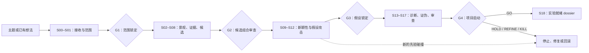

# Research Forge（中文）

[English](README.md) · [简体中文](README.zh-CN.md)

> **不要问一个研究想法听起来是否新颖；先尝试证明它并不新颖。**

## 概述

Research Forge 是一套面向 AI 与深度学习方法研究的、有状态的对抗式科研选题 Skill。它把一个宽泛的研究方向或一个已经被偏爱的想法，推进为有证据链接的 `GO`、`HOLD`、`REFINE`、`HOLD_RESOURCE` 或 `KILL` 决策，并把高成本实验放到后面。

**状态：** v1 协议实现。本仓库包含确定性的契约检查，但不声称相对于其他 Skill 具有实证性能优势，也不保证研究一定成功。

## Research Forge 解决什么问题

许多科研工作流都擅长产生听起来合理的方向，而“听起来合理”并不是最困难的部分。

一个方向仍然可能因为以下原因失败：

- 所谓的研究空白已经被强先验工作覆盖；
- 当宽泛主张被逐层剥离后，贡献消失；
- 方法没有机制层假设，也没有可区分的预测；
- 更简单的替代解释同样能够解释观察结果；
- 实验无法证伪核心主张；
- 增益依赖不匹配的数据、算力、调参或评测条件；
- 想法在科学上有趣，但当前不可执行；
- 项目通过了内部讨论，却经不起审稿人审查。

Research Forge 把选题视为一个**降低科研风险的问题**。它的任务不是替想法辩护，而是判断在严肃攻击之后究竟还有什么能够存活。

## 与常见选题工作流的区别

这是一份契约层面的比较，不是实证 benchmark。下表中的“常见工作流”是简化的工作流原型，并不代表每一个研究助手或选题 Skill。

| 维度 | 常见的灵感生成或选题工作流 | Research Forge 契约 |
|---|---|---|
| 首要目标 | 产出合理、有趣的方向 | 得到有证据链接的项目决策 |
| 默认立场 | 扩展并改进想法 | 搜索以拒绝，并暴露失败条件 |
| 文献作用 | 总结相关工作 | 建立查询图、以最强形式理解先验并攻击新颖性 |
| 新颖性 | 把表面空白当作候选贡献 | 剥离重叠主张，保留经过限定的残余边界 |
| 知识控制 | 把来源和解释混合进顺畅 prose | 分开证据、主张、推断、假设、矛盾和未知项 |
| 假设 | 常常在架构提出之后才补上 | 必须无方法依赖、具机制性、可预测且可证伪 |
| 实验 | 选定方法后证明增益 | 先做能杀死或区分假设的最低成本测试 |
| 基线 | 对比论文报告的分数 | 匹配数据、优化、增强、评测和调参预算 |
| 流程记忆 | 对话或一次性报告 | 有版本的项目状态、稳定 ID、快照、回滚和决策日志 |
| 人类控制 | Agent 默认继续推进 | 四个人工 Gate；沉默永远不算批准 |
| 最终结果 | 排名后的想法或研究计划 | `GO`、`HOLD`、`REFINE`、`HOLD_RESOURCE` 或 `KILL`，以及显式 GO 后的实验 dossier |

## 核心亮点

### 1. 搜索的设计目标是拒绝

[搜索协议](protocols/search.md) 围绕问题、机制、主张、邻近术语、引用和最新工作建立查询族。强先验工作必须以合理的最强形式解释。对新颖性敏感的工作必须记录检索截止日期并执行新鲜搜索，不能无依据地声称“最新”。

威胁使用 **T0–T5** 分级，来源使用 **R0–R4** 阅读深度。正式的 T4/T5 威胁需要从适当的一手来源进行深入核验；搜索摘要不够作为证据。

### 2. 证据和推理保持可检查

Research Forge 不把所有内容压扁成自信的 prose。[证据协议](protocols/evidence.md) 和 schemas 为以下记录保留稳定、可链接的结构：

- 证据与 provenance；
- 主张及其依赖边；
- 新颖性威胁及受影响主张；
- 假设、替代解释、预测和证伪条件；
- 矛盾与未解决的 reasoning debt；
- 候选谱系与决策历史。

`FACT`、`INFERENCE`、`HYPOTHESIS` 和 `UNKNOWN` 是不同的认识论状态。证据不足意味着尚未解决，不会自动等于错误。

### 3. 新颖性是逐层剥离后剩下的部分

发现重叠后不能靠换一种说法来规避。[新颖性协议](protocols/novelty.md) 会记录：哪条主张被杀死、什么证据杀死它、剩下什么，以及剩余主张是否仍具有机制深度、科学一般性、影响力和有意义的优化空间。即使项目此前已经 GO，新核验的先验碰撞仍然可以冻结项目。

### 4. 假设先于架构

核心假设必须在不依赖某个偏好模块名称的情况下描述机制，并且必须给出能够区别于钢人化替代解释的观察预测。详见[假设协议](protocols/hypothesis.md)。

这样可以避免把熟悉的组合——例如“backbone X 加 loss Y 用于任务 Z”——仅仅因为没有使用同一个名称，就误认为科学贡献。

### 5. 证伪先于优化

[证伪协议](protocols/falsification.md) 要求寻找最低成本、最高信息量的测试，用来拒绝机制、暴露可实现上限几乎不存在，或支持更简单的解释。决策阈值和歧义分支必须在查看结果之前记录。

负面证据会保留在项目记忆中。沉没成本、已经投入的实现工作和作者偏好，都不会削弱一个有效的 killer。

### 6. 流程具有状态、Gate 和回滚

Research Forge 运行 **S00–S18** 状态机，而不是一次性 prompt。四个人工 Gate 控制范围、候选选择、假设锁定和项目启动。被证伪的证据可以触发局部修复、结构回滚或状态重入，同时保留谱系。详见 [Gate](runtime/gates.md) 和[回滚](runtime/rollback.md)。

### 7. 科学价值和执行就绪度分开

一个有潜力的方向不能因为暂时缺少算力、数据、许可证或实现条件，就被错误判定为科学上无效。Research Forge 分开处理科学、执行和发表决策；资源限制可以产生 `HOLD_RESOURCE`，而不是伪造科学否定。

### 8. GO 产生交接契约，而不是胜利宣言

显式 G4 批准后，S18 会组装一个 30 项的 experiment-ready dossier，包含主张、假设、控制、指标、阈值、失败分支、资源估计和明确的下一步动作。下游实验执行者可以执行计划，但不能悄悄重写其中的科学契约。详见[交接协议](runtime/handoff.md)。

## 研究生命周期



## 适用场景

以下情形适合使用 Research Forge：

- 你有一个宽泛的 AI 方法主题，需要建立可辩护的候选组合；
- 你已经有一个想法，需要做对抗式新颖性和机制审计；
- 你不确定表面上的文献空白是否有科学意义；
- 你有一个有趣观察，却没有干净的机制假设；
- 你想在高成本训练前对项目进行 triage；
- 你需要在投稿前进行审稿人式攻击；
- 你有一个被中断、但状态仍然有效的 Research Forge 项目。

如果你只是需要快速列出想法、做普通文献综述、写完整论文或让 Agent 自主运行长期实验，它不是合适的工具。

## 使用方法

### 前置条件

你需要：

- 一个能够加载目录型 Skill 的 Agent 主机；
- Python 3，用于运行仓库内的确定性检查；
- 一个独立且可写的 research-project workspace；
- 当新颖性依赖最新文献时，具备当前网页、学术检索或全文工具；
- 一位能够在四个 Gate 做决定的人类合作者。

Research Forge 定义协议，但不会自动获得数据库访问、自动下载付费论文或运行模型训练。可获得的证据取决于主机环境中的工具和权限。

### 安装

在个人 Codex 环境中：

1. 下载或克隆完整仓库；
2. 将目录放到 `~/.codex/skills/research-forge/`；
3. 确认 `~/.codex/skills/research-forge/SKILL.md` 直接位于该目录下；
4. 重新加载主机，使其发现 Skill。

在其他兼容 Agent 主机中，把仓库放入该主机的 Skills 目录。保持内部结构不变：`SKILL.md` 负责路由，`protocols/`、`states/`、`schemas/`、`templates/`、`runtime/` 和 `domain/` 负责不同的契约。

安装 Skill 和创建研究项目是两件不同的事。不要把实时研究记录放进已安装的 Skill 目录。

### 调用

当主机支持按名称调用已安装的 Skill 时，使用：

```text
/research-forge
```

如果主机使用菜单或其他调用约定，请按名称选择 `research-forge`。输入可以是宽泛研究方向、已有想法，或需要恢复的项目绝对路径。

Research Forge 会创建或恢复独立的 **research-project workspace**。Skill 仓库是协议，项目 workspace 才是持续演化的研究记忆。

#### 1. 探索宽泛方向

当你想在承诺一个具体想法之前先梳理主题，使用 `EXPLORATION`。

```text
/research-forge

Use EXPLORATION mode.
Topic: robust tiny-object detection for edge deployment.
Starting observation: small instances fail disproportionately under aggressive downsampling.
Constraints: public datasets, two consumer GPUs, six-week validation window.
Publication horizon: current major computer-vision venues.
Project workspace: /absolute/path/to/tiny-object-research

Build diverse mechanism candidates, search to reject them, and stop at every
human gate. Do not treat the starting observation as a verified cause.
```

早期行为应当是：S00 把观察记录为未核验信息，G1 锁定研究边界，S02–S08 建立并攻击多样候选组合，然后由 G2 选择 finalists。

#### 2. 验证已有想法

当你已经有候选方法或新颖性主张时，使用 `IDEA_VALIDATION`。

```text
/research-forge

Use IDEA_VALIDATION mode.
Candidate idea: replace the YOLO feature-fusion block with a state-space module
to improve tiny-object context modeling.
Claimed mechanism: longer-range spatial interactions recover context lost by
local fusion.
Constraints: preserve real-time inference and use the same training data.
Project workspace: /absolute/path/to/ssm-yolo-audit

Preserve the original idea, generate alternative mechanisms, attack the claim
with the strongest prior art, and identify the residual contribution after
innovation peeling. Stop at every human gate.
```

该模式不会假定想法新颖。它会保留原始候选，使后续的 refinement、被杀死的主张和替代机制候选都能够追踪。

#### 3. 恢复已有项目

从项目根目录恢复，而不是依靠记忆重新口述研究历史。

```text
/research-forge

Resume the Research Forge project at:
/absolute/path/to/tiny-object-research

Validate saved state and the latest immutable snapshot, load blocking threats,
contradictions, reasoning debt, search freshness, and the pending gate, then
continue from the current valid state. Do not silently reconstruct uncertain data.
```

运行时会按固定顺序加载 `state/research_state.yaml`、快照、活跃候选与假设、T4/T5 威胁、开放矛盾、阻塞债务、搜索状态和近期决策。

### 通过人工 Gate

Research Forge 必须在每个 Gate 停下来，等待明确决定：

| Gate | 人类决定 |
|---|---|
| `G1_SCOPE_LOCK` | 批准或修改任务、方法、时间、场所、资源和兴趣边界 |
| `G2_PORTFOLIO_REVIEW` | 审查 survivors、kills、威胁、成本和不确定性，最多选择 1–3 个 finalists |
| `G3_HYPOTHESIS_LOCK` | 锁定存活的无方法假设、替代解释、预测和证伪条件 |
| `G4_PROJECT_LAUNCH` | 根据 project-decision packet 选择 GO、HOLD、KILL 或 REVISE |

沉默不是批准。你可以批准、要求修改、暂缓项目或拒绝建议的状态转移。在 `G4_PROJECT_LAUNCH` 获得明确 GO 之前，S18 不可用。

## 决策与输出

| 决策 | 含义 |
|---|---|
| `GO` | 当前 Gate 下科学论证存活，值得在记录的条件下测试 |
| `HOLD` | 证据、测量有效性、统计能力或依赖不足，暂时无法决策 |
| `REFINE` | 更窄或结构上修订后的候选可能存活，但当前形式不行 |
| `HOLD_RESOURCE` | 科学价值可能存在，但执行条件暂时缺失 |
| `KILL` | 硬性科学条件失败，或没有有意义的残余项目 |

`GO` 的意思是“值得测试”，不是“保证有效”，也不是发表保证。

在 G4 之前，主要输出是有版本的 evidence、claim、threat、candidate、hypothesis、contradiction、search 和 decision 记录。明确 GO 后，[S18](states/S18-experiment-dossier.md) 生成 experiment dossier 和机器可读的 handoff。

## 仓库结构

```text
research-forge/
├── SKILL.md              # 运行入口与路由
├── protocols/            # 跨状态科研规则
├── states/               # S00–S18 状态契约
├── domain/ai-methods/    # AI 方法诊断知识
├── templates/            # 记录与报告形状
├── schemas/              # ID、枚举、有效性和跨记录约束
├── runtime/              # 启动、上下文、Gate、事务、恢复、交接
├── examples/             # 正确执行模式
└── tests/                # 确定性与场景验收契约
```

[`SKILL.md`](SKILL.md) 负责运行时路由。详细规则留在各自目录，使编排、科研政策、状态转移、记录有效性和项目数据不会坍缩成一个 prompt。

生成的研究数据属于仓库之外。典型的项目 workspace 包含实时状态、不可变快照、registries、reports、Gate packet 和最终 handoff；可以参考 [`templates/project-bootstrap.yaml`](templates/project-bootstrap.yaml) 的 bootstrap 形状。

## 验收

运行仓库元数据检查：

```bash
python3 tests/check_repository.py
```

运行 README 契约检查：

```bash
python3 tests/check_readme.py
```

运行科研结构和行为验收套件：

```bash
python3 tests/run_acceptance.py --skill-root .
```

运行双语 README 检查：

```bash
python3 tests/check_bilingual_readme.py
```

验收材料还包含状态转移、证据传播、新颖性攻击、推理完整性和对抗压力场景，位于 [`tests/`](tests/acceptance-tests.md)。

## 范围与非目标

Research Forge 不会：

- 训练模型或运行长期实验；
- 修改大型实现代码库；
- 撰写完整投稿论文；
- 通过改名或表面组合制造新颖性；
- 保证新颖性、实验成功、录用或发表层级；
- 因为用户偏好某个想法而降低科研标准；
- 从缺失的搜索结果推导事实；
- 在人工 Gate 待决时继续向后推进。

它的边界止于证据同步的 experiment dossier。实验执行和论文生产属于下游工作流。

## 贡献

贡献应当保持仓库的职责边界：

1. 把跨状态科研规则放入 `protocols/`，状态工作放入 `states/`，有效性规则放入 `schemas/`，生命周期行为放入 `runtime/`；
2. 修改科研契约前先增加或更新确定性检查或场景验收；
3. 保持保守的证据传播、明确的人工 Gate、稳定 ID 和不可变决策历史；
4. 提交前运行全部验收命令。

削弱证据要求、静默绕过 Gate，或把用户偏好变成科研证据的修改，不属于 v1 范围。

## 许可证

本项目采用 [Apache License 2.0](LICENSE)。
